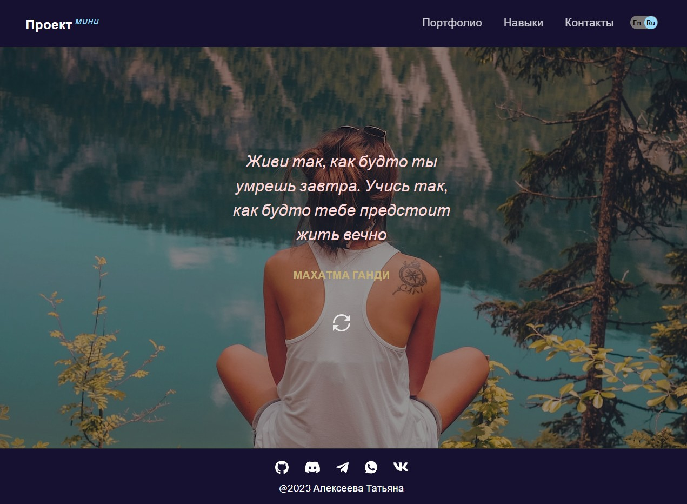

# Генератор цитат

Учебный проект, предназначенный для получения опыта работы с API - асинхронного получения данных и отображения их на странице.

## **Описание проекта**

* При загрузке страницы приложения отображается рандомная цитата.
* При перезагрузке страницы цитата обновляется (заменяется на другую).
* Есть кнопка, при клике по которой цитата обновляется (заменяется на другую).
* Смена цитаты сопровождается сменой фонового изображения.
* Можно выбрать один из двух языков отображения цитат: en/ru.
* В качестве источника цитат используются JSON-файлы
* Адаптивная верстка для экранов 320px и выше

## **Стек технологий**

## [**Демо**](https://star-wars-ruby-pi.vercel.app/)
